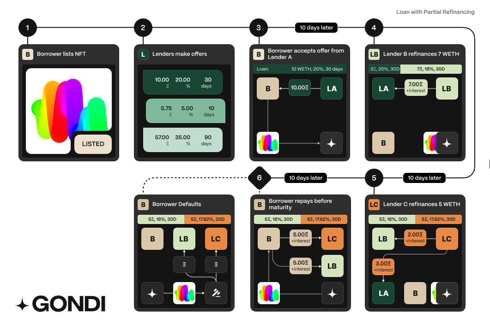

## Instant Refinancing

Gondi enables instant refinancing. Any lender can improve the loan terms of any outstanding loan without any borrower's action.A loan can be refinanced by lowering its APR by at least 1%.Lenders may also extend the loan's due date or increase the loan's principal as long as APR is also lowered. In the case of Principal increase, the loan's APR needs to be lowered such that the daily interest paid by a borrower is the same or smaller than the current one.​At refinancing, the prospective (new) lender transfers the loan's principal and accrued interest to the original (old) lender. There is no limit to the times a loan can be refinanced, with each incoming lender responsible for the interest accumulated from the loan's origination.Two conditions must be met to execute an instant refinance:

1. 1.The borrower's daily interest must exhibit a net reduction
2. 2.The existing loan's due date must either be maintained or extended.

APR and Principal minimum improvements are 1%. In the case of extending a loan's due date, the minimum improvement is 10% of the loan's remaining duration (expressed in whole days and rounded up).In the case of an instant refinance with a larger principal, the additional amount is transferred to the borrower's wallet.Interest is pro rated based on outstanding time. Borrowers may repay at any point in time before loan maturity and only owe interest based on outstanding time.Origination fees cannot be added as part of a refinance.

### Partial Refinancing

A loan can be partially refinanced such that it can consist of up to 10 different tranches, where each tranche must be at least 5% of the overall principal amount of the loan. Refinancing a fraction of a loan is possible as long as the Annual Percentage Rate (APR) is improved (lowered) by at least 1% and the principal of the new tranche is at least 5% of the total principal amount.When partially refinancing a loan, the protocol does not allow due date or principal amount change since this would change the risk profile of the loan overall, potentially affecting other existing lenders of the given loan.Gondi Loan example with Partial Refinancing**Example I**Consider a loan which originally has a principal of 10 WETH and 20% APR, and it's then refinanced by Bob (Lender B), who takes 7 WETH at 18%:

* 3 WETH at 20% APR provided by Alice (Lender A)
* 7 WETH at 18% APR provided by Bob

A prospective lender, Charly (Lender C) wishes to refinance 5 WETH. Since the principal must remain the same, this means that he would refinance the 3 WETH that were originally provided by Alice, as well as 2 WETH by Bob. In this case, it would need to propose a minimum of 1% improvement to the lowest existing APR (18%). The outcome of this refinancing operation would be:

* 5 WETH at 18% APR held by Bob
* 5 WETH at 17.82% APR provided by Charly

**Example II**Let us now consider the loan from the previous example before it's been refinanced by lender 3. Now, Charly's desired principal amount is only 2 WETH, then the 1% improvement would be towards Alice's 20% APR. The outcome of this partial refinancing operation would be:

* 1 WETH at 20% APR provided by Alice
* 2 WETH at 19.8% APR from Charly
* 7 WETH at 18% APR provided by Bob

These examples are to illustrate the minimum improvements. Prospective lenders can opt to decrease the APR by more than 1%.

### From Multiple Tranches to a Single-Lender

Lenders can also choose to refinance all outstanding tranches of a given loan. To initiate this process, the prospective lender would still need need to set an Annual Percentage Rate (APR) that is at least 1% lower than the APR of the tranche with the lowest rate. Additionally, this also allows them to extend the duration of the loan.The protocol also allows for an increase in the principal amount, as long as the daily interest of the new combined loan remains lower than the combined daily interest of all tranches.The protocol then merges all tranches into a single loan with the improved terms set by the prospective lender. Similar to other refinancings, prospective lender repay the outstanding principal and accrued interest to the current lenders, and takes on the responsibility of the loan moving forward.
