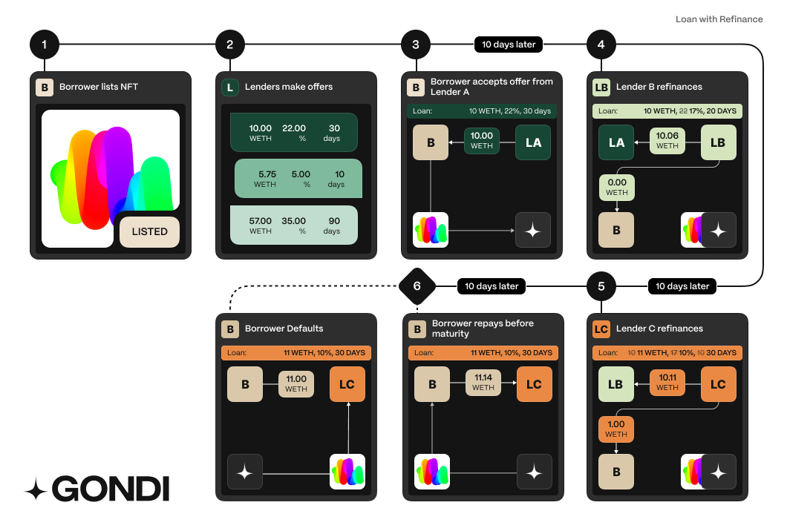

## Simple Loan Example

_Gondi Loan without refinancing_

**How it works:**

1. Borrower lists its NFT (ERC-721). Items can receive offers without being listed, but listing signals that the borrower is actively seeking a loan.
2. Lenders make offers against the listed collateral.
3. The borrower accepts an offer which transfers the principal from the lender and sends the collateral into Gondi's escrow contract.
4. The loan is repaid in full including accrued interests and the NFT is retrieved to the borrower.
5. In case the loan is not repaid before maturity, the lender can claim the escrowed NFT and transfer it to its wallet. 

## Loan with Refinance

_Gondi Loan with Refinancing_

Steps 1, 2 and 3 are identical to the simple loan example.

Borrower accepted Alice's (Lender A's) loan offer:

* Principal: 10.00 WETH
* APR: 22%
* Duration: 30 days

Note: Refinancing a loan requires that the due date is the same or further out in the future than the current due date.

4. **10 days into the loan, Bob (Lender B) refinances the loan by providing better loan terms. New loan terms are:**

* Principal: 10 WETH
* APR ~~22%~~ 17%
* Duration: 20 days (same due date)

Bob must transfer 10 WETH as principal and Alice's accrued interest. Alice's daily interest rate is 0.0602% accruing 0.0602 WETH over 10 days.

Bob total cost is 10.0602 WETH (principal plus accrued interest) and gas fee. Bob executes the transaction successful and becomes the new lender of record.

5. **At day 20, Charly (Lender C) refinances the loan with the following loan terms:**

* Principal: ~~10 WETH~~ 11.00 WETH
* APR:  ~~17%~~ 10%
* Duration: ~~10 days~~ 30 days

Bob's daily interest rate is 0.0465% accruing 0.0465 WETH during 10 days.

The total cost for Charly to refinance the loan is 11 WETH + 0.0465 WETH (Bob's interest) + 0.0602 WETH (Alice's interest) = 11.1068 WETH.

Note: Charly must include accrued interest of Alice and Bob.

The transaction is split as follows:

* 10.1068 WETH to Lender B (principal, B's interest and A's interest)
* 1 WETH to Borrower as additional principal

Note: Charly had to lower the loan's APR such that daily interest amount is lower than what Bob was accruing with a lower principal.

Bob daily interest: 0.00465 WETH (10 WETH principal at 17% APR)

Charly daily interest: 0.00301 WETH (11 WETH principal at 10% APR)

6. **Borrower repays loan 10 days later( 30 days after origination in total)**

Charly refinanced the loan at day 20 with a 30 day duration from that moment. Due date is 50 days after initial origination. The Borrower, however, decides to pay 10 days after Charly refinanced the loan.  

Charly accrued interest: 0.03013 WETH (0.003013 WETH daily interest over 10 days)

Borrower repayment breakdown:

* 11 WETH principal
* 0.0301 WETH for Charly's accrued interest
* 0.0465 WETH for Bob's accrued interest
* 0.0602 WETH  for Alice's accrued interest

Total interest paid by borrower: 0.1369 WETH. Without refinancing, the interest paid would have been 0.1808 WETH.

In summary,  the borrower **saved 24.24% in interest**, had 1 WETH more in liquidity for 10 days, and had another 20 extra days to repay the loan.
