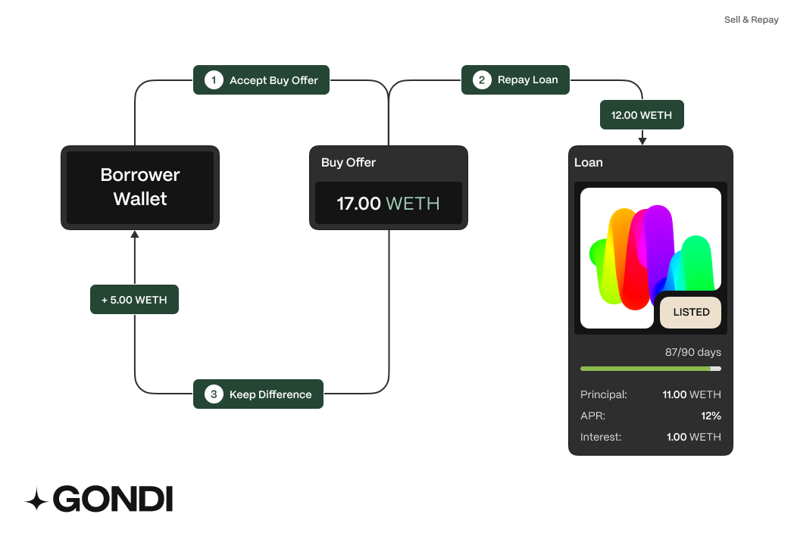

Repayment
---------

## Basic Repayment

Loans can be repaid anytime before the due date. You'll only pay interest up to the repayment time, not the full loan duration. If you miss the due date, you risk losing your collateral.**Repayments must be done in full (principal & accrued interest) and prior to the due date.**

## Sell & Repay

Alternatively, loans can also get repaid by selling the underlying collateral. Borrowers may accept buy offers on Gondi's dApp in order to repay the loan in the same transaction. Borrowers may only opt for this option when the Net Proceeds from a sale are at least the same as the owed Principal + Accrued interest. Any excess amount from a sell & repay transaction is kept by the borrower.​
