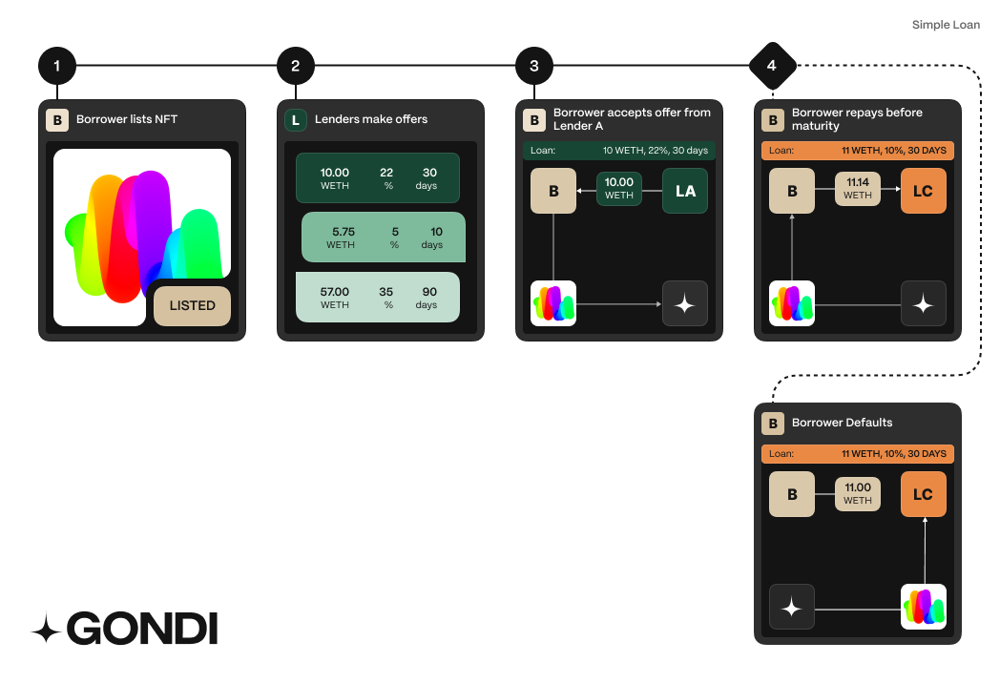

### Loan Properties

Every GONDI loan has:

* **Principal Amount**: Loan size (in WETH or USDC)
* **Gross APR**: Annual percentage rate
* **Due Date**: Repayment deadline to avoid default
* **Origination Fee**: Optional upfront fee (deducted from principal)
* **Collateral**: Your NFT (ERC-721s, ERC-1155s, legacy ERC-721s)

:::note
**Pro Rata Interest**

Interest only accrues while your loan is active. Repay early to save on interest costs - no penalties for early repayment.
:::

## Loan Example

_Gondi Loan without refinancing_

### How Loans Work

1. **Browse**: List your NFT to see available offers
2. **Select**: Choose loan amount and terms - GONDI automatically finds the cheapest combination
3. **Receive Funds**: Get principal minus any origination fees; your NFT goes to escrow
4. **Repay**: Pay back principal plus interest before due date to retrieve your NFT
5. **Default**: If unpaid by due date, lenders can claim your NFT through liquidation

### Repayment Rules

* **Full repayment only**: Must pay principal + all accrued interest at once
* **No partial payments**: Installments not supported
* **Anytime before due date**: No early repayment penalties
