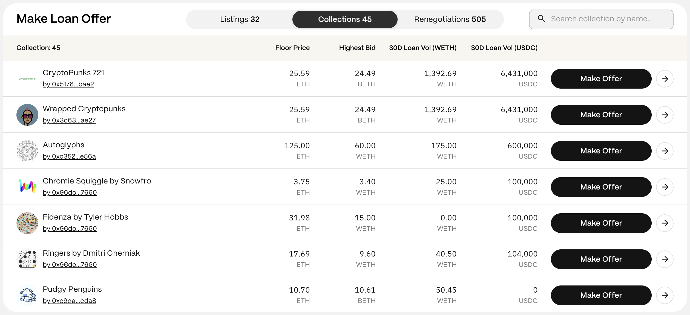
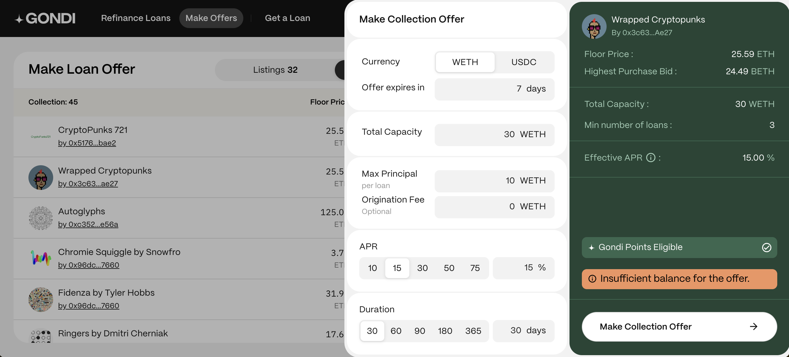

Collection loan offers target [whitelisted collections](/gondi-v3/whitelisted-collections/) rather than specific NFT listings. Borrowers can accept these offers anytime using an NFT from the specified collection as collateral. For more information on how loan offers work, visit [Loan Offers](/gondi-v3/loan-offers/).

## Step 1: Find a Collection

Navigate to the [Make Offers](https://www.gondi.xyz/make-offers#listings) page and select the ‘Collections’ tab to see all the whitelisted collections at GONDI that you can make offers to.

## Step 2: Select a Collection

Click the 'Make Offer' button next to the desired collection to open the offers panel.

:::note
For more details on the item, click the white arrow to open its profile page. Here, you'll find past activity and other information. You can also start a loan offer from the profile page.
:::

## Step 3: Connect Your Wallet

If not already connected, you'll be prompted to connect your wallet.

:::caution
Ensure you are navigating on <https://gondi.xyz> for security.
:::

## Step 4: Define Your Loan Offer

When listing an item, borrowers can signal their currency and duration preferences. Lenders can submit offers with different terms, but offers that match the borrower's preferences have a higher chance of acceptance.

* **Currency:** The asset you offer (WETH or USDC).
* **Expiration Date:** Set a timeframe for your offer's validity. At least three days is recommended.
* **Total capacity:** The maximum amount of capital you're willing to lend to the collection.
* **Max. Principal:** Enter the max. amount you're open to lending to individual loans.
* **Origination Fee (optional):** An origination fee (up to 10% of the principal, typically not exceeding 2%) can be optionally included.
* **APR:** Select your desired interest rate.
* **Duration:** Set the deadline by which the borrower must repay the principal and interest.
* **Min. Number of Loans:** The total capacity can be distributed among at least this number of loans.
* **Effective APR:** Shows the loan’s final APR, including the origination fee.

## Step 5: Make the Offer

When ready, click 'Make Collection Offer'. Review the terms, then sign the approval transaction with your wallet (you’ll need a small amount of gas).

:::tip
You can make loan offers without having enough balance in your wallet, but the offer will only be visible to borrowers once your wallet has sufficient funds.
:::

## Step 6: Wait for Borrowers to Accept

Once you submit a collection loan offer, GONDI users can view your offer on the offers page of each collection. Holders of NFTs from those collections seeking loans on GONDI can instantly accept an offer within the offer's specified timeframe. You’ll be notified of their decision by email or through the GONDI notifications page.

:::note
Lenders can submit multiple offers with different terms for the same collection to increase the likelihood of borrowers finding one attractive and accepting it.
:::

***

These steps should help you effectively submit a collection loan offer. Feel free to holler in [GONDI’s Discord](http://discord.gg/gondi) if you need further assistance.
