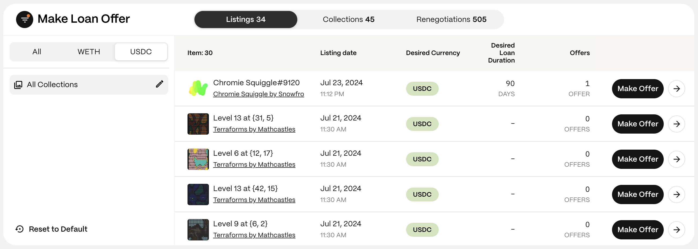
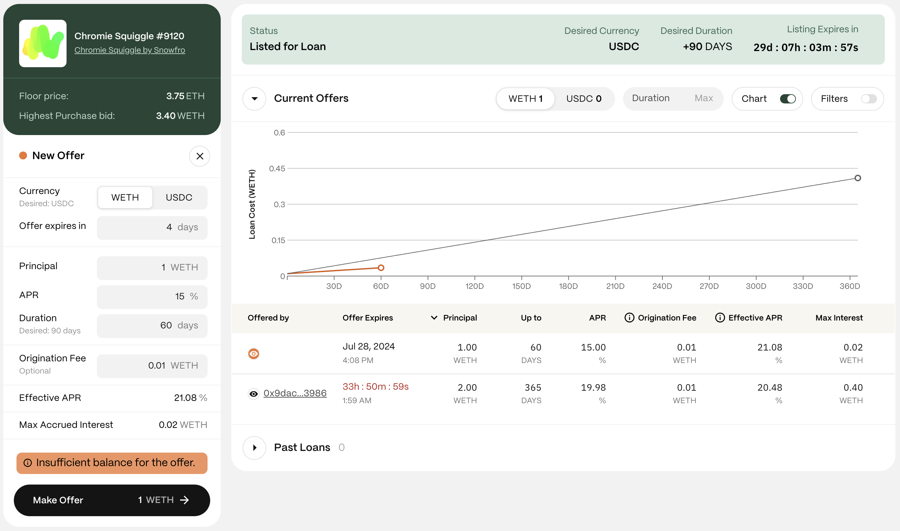

Standard loan offers are proposals from lenders to borrowers who have listed an NFT, indicating they seek loans against it. Each offer details the terms, including the principal, APR, due date, and optional origination fee. For more information on how these work, visit [Loan Offers](/gondi-v3/loan-offers/)

## Step 1: Find Listed Items

Navigate to the [Make Offers](https://www.gondi.xyz/make-offers#listings) page and select the ‘Listings’ tab to see all NFTs seeking loan offers.

## Step 2: Use Filters to Find Items

When borrowers list an item seeking a loan, they can optionally specify their desired terms, such as currency and loan duration. These details are visible in each item listing and on the offer page.

* **Currency (WETH or USDC):** Choose the asset used for the principal.
* **Collections:** View all loans or select a specific collection.

## Step 3: Select an Item

Click the 'Make Offer' button next to the desired loan to enter the Offer page.

:::note
For more details on the item, click the white arrow to open its profile page. Here, you'll find past activity and other information. You can also start a loan offer from the profile page.
:::

## Step 4: Connect Your Wallet

If not already connected, you'll be prompted to connect your wallet.

:::caution
Ensure you are navigating on <https://gondi.xyz> for security.
:::

## Step 5: Define Your Loan Offer

When listing an item, borrowers can signal their currency and duration preferences. Lenders can submit offers with different terms, but offers that match the borrower's preferences have a higher chance of acceptance.

* **Currency:** The asset you offer (WETH or USDC).
* **Expiration Date:** Set a timeframe for your offer's validity. At least three days is recommended.
* **Principal:** Enter the loan amount you want to lend.
* **APR:** Select your desired interest rate.
* **Duration:** Set the repayment deadline.
* **Origination Fee (optional):** Optionally include an origination fee (up to 10% of the principal, typically not exceeding 2%).
* **Effective APR:** Shows the loan’s final APR, including the origination fee.
* **Max Accrued Interest:** The maximum interest the lender will receive if the borrower repays just before the due date. With GONDI’s pro-rata system, if the borrower pays back earlier, the APR will be lower.

## Step 6: Make the Offer

When ready, click 'Make Offer'. Review the terms, then sign the approval transaction with your wallet (you’ll need a small amount of gas).

:::tip
You can make loan offers without having enough balance in your wallet, but the offer will only be visible to the borrower once your wallet has sufficient funds.
:::

## Step 7: Wait for Borrower

Once you submit a loan offer, the borrower should review it and respond within the specified timeframe. If you submit it in your GONDI profile, you’ll be notified of their decision by email or through the GONDI notifications page.

:::note
Lenders can submit multiple offers with different terms for the same item to increase the likelihood of the borrower finding one attractive and accepting it.
:::

***

These steps should help you effectively submit a loan offer. Feel free to ask in [GONDI’s Discord](http://discord.gg/gondi) if you need further assistance.
