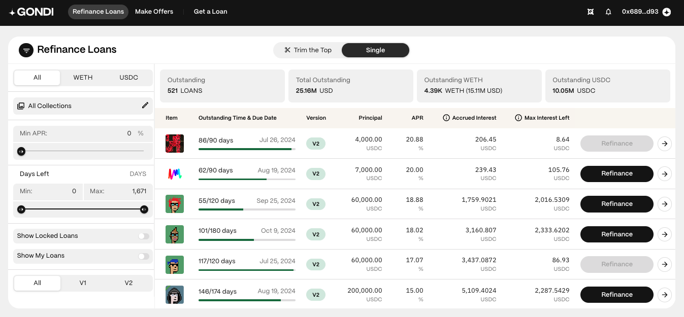
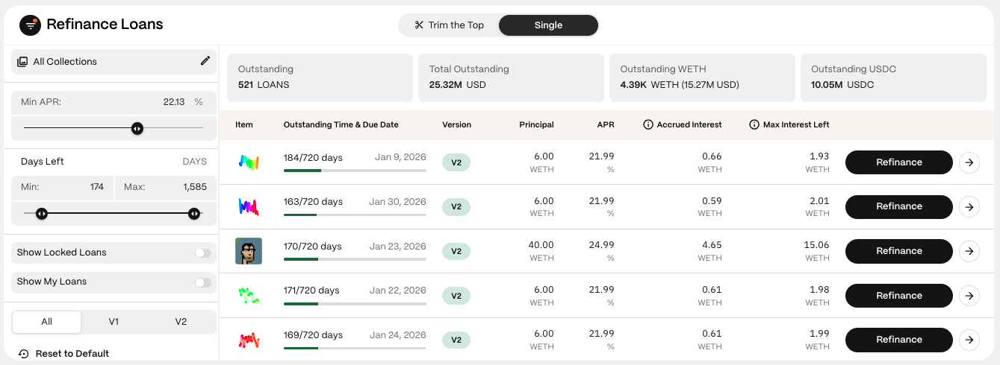
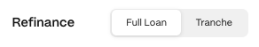

## Step 1: Open the [Refinance Loans](https://www.gondi.xyz/refinance/loans#single) Page

Navigate to the 'Single' tab to see a list of all the outstanding loans available for refinancing.

## Step 2: Use Filters to Find the Right Loan

Use the filters to finesse your search and find the opportunity you want.

* **Asset (WETH or USDC):** Choose the asset used for the principal.
* **Collections:** View all loans or select a specific collection.
* **Min APR:** Filter out loans with an APR lower than your selected rate.
* **Days left:** Use the slider to filter loans by the remaining duration.

## Step 3: Select a Loan

Click on the 'Refinance' button next to the desired loan to open its refinance panel. For more details, click the white arrow to open the loan's profile page. Here, you'll find past activity and other information, and you can also start the renegotiation process.

## Step 4: Connect Your Wallet

If not already connected, you'll be prompted to connect your wallet.

:::caution
Ensure you are navigating on <https://gondi.xyz> for security.
:::

## Step 5: Select the 'Full Loan' Tab

## Step 6: Lower the APR (Required)

Move the slider to reduce the APR to your preferred rate. All loan refinancing requires an APR decrease of at least 5%.

## Step 7: Increase Principal (Optional)

If desired, increase the principal amount. The new daily interest the borrower pays must exhibit a net reduction.

:::note
The minimum required improvement for the principal amount is 5%.
:::

## Step 8: Extend the Due Date (Optional)

Optionally, extend the due date by selecting a date on the calendar or moving the slider. The minimum principal improvement required is 10% of the remaining loan duration.

:::note
Refinancing does not allow shortening a loan's due date.
:::

## Step 9: Review and Confirm

Review all the terms carefully before confirming the transaction.

### Key terms include

1. **New Principal:** The amount of WETH or USDC being lent or borrowed.
2. **New APR:** The updated annual percentage rate—representing the loan's annualized yield.
3. **New Daily Interest:** The updated daily cost for the borrower.
4. **New Due Date (maturity):** The final date the borrower must repay to avoid default.
5. **Exp. Interest Left:** The expected interest the borrower should pay.
6. **Accrued interest:** The existing lender's accrued interest, which must be paid upfront by new lenders. Note: This isn't a cost as the borrower will repay it along with the interest and it won't reduce the 'Exp. Interest Left.'

After reviewing, click 'Refinance' and sign with your wallet to confirm the transaction.

:::note
Once refinanced, the loan enters a lockout period lasting 5% of the remaining loan duration. During this time, the loan cannot be refinanced by anyone else, providing a brief window of exclusivity to the refinancer.
:::

***

These steps should guide you through the process of refinancing a single loan effectively. If you need further clarification or assistance, feel free to ask in [GONDI’s Discord](http://discord.gg/gondi).
