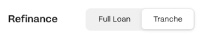

## Step 1: Visit the Refinance Loans Page

Open the [Refinance Loans](https://www.gondi.xyz/refinance/loans#single) page. Navigate to the 'Single' tab to see a list of all the outstanding loans available for refinancing.

## Step 2: Use Filters to Find the Right Loan

Use the filters to finesse your search and find the opportunity you want.

* **Asset (WETH or USDC):** Choose the asset used for the principal.
* **Collections:** View all loans or select a specific collection.
* **Min APR:** Filter out loans with an APR lower than your selected rate.
* **Days left:** Use the slider to filter loans by the remaining duration.

## Step 3: Select a Loan

Click on the 'Refinance' button next to the desired loan to open its refinance panel.

:::note
For more details, click the white arrow to open the loan's profile page. Here, you'll find past activity and other information. You can also start the refinance process there.
:::

## Step 4: Connect Your Wallet

If not already connected, you'll be prompted to connect your wallet.

:::caution
Ensure you are navigating on <https://gondi.xyz> for security.
:::

## Step 5: Select the 'Tranche' Tab

## Step 6: Choose Tranche

Move the slider to select your tranche amount or type it in. Each tranche must be at least 5% of the overall principal amount of the loan.

## Step 7: Lower the APR

Move the slider to select your improved APR or type it in. The APR must be reduced by at least 5% for the selected principal amount.

## Step 8 - Review and Confirm

Review all the terms carefully before confirming the transaction.

### Key terms include

1. **New Principal:** The amount of WETH or USDC being lent or borrowed.
2. **New APR:** The updated annual percentage rate—representing the loan's annualized yield.
3. **New Daily Interest:** The updated daily cost for the borrower.
4. **New Due Date (maturity):** The final date the borrower must repay to avoid default.
5. **Exp. Interest Left:** The expected interest the borrower should pay.
6. **Accrued interest:** The existing lender's accrued interest, which must be paid upfront by new lenders. Note: This isn't a cost as the borrower will repay it along with the interest and it won't reduce the 'Exp. Interest Left.'

After reviewing, click 'Refinance' and sign with your wallet to confirm the transaction.

:::note
If a loan already has two tranches or more, subsequent refinancing events will refinance higher APR tranches first.
:::

***

These steps should guide you through the process of using the partial refinance feature effectively. If you need further clarification or assistance, feel free to ask in [GONDI’s Discord](http://discord.gg/gondi).
