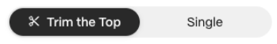

## Step 1: Visit the Refinance Loans Page

Navigate to the [Refinance Loans](https://www.gondi.xyz/refinance/loans#trim-the-top) page and select the "Trim the Top" tab.

## Step 2: Select the Collection

Choose the collection you want to trim, for example, CryptoPunks.

## Step 3: Enter the Trim Amount

Using the slider, enter the total principal amount you will be lending across the loans you trim (marked with a black check). Loans marked with a '✓' will be fully refinanced. Loans with a ‘—’ will be partially refinanced.

## Step 4: Use Filters to Narrow Down Loans

Use the filters to narrow down the loans you want to refinance:

* **Principal:** Filter loans by their outstanding principal.
* **Days Left:** Filter loans based on the remaining days.

## Step 5: Select the Percentage for Refinancing

Choose the percentage you want to improve the loans by—options are 5%, 10%, or 15%. Higher improvements reduce the interest collected but also the likelihood of your loan getting refinanced by another lender.

## Step 6: Review and Confirm

Carefully review the details of the Trim the Top refinance. If everything is correct, click the "Refinance" button and confirm the transaction in your wallet.

***

These steps should guide you through the process of using the Trim the Top feature effectively. If you need further clarification or assistance, feel free to ask in [GONDI’s Discord](http://discord.gg/gondi).
