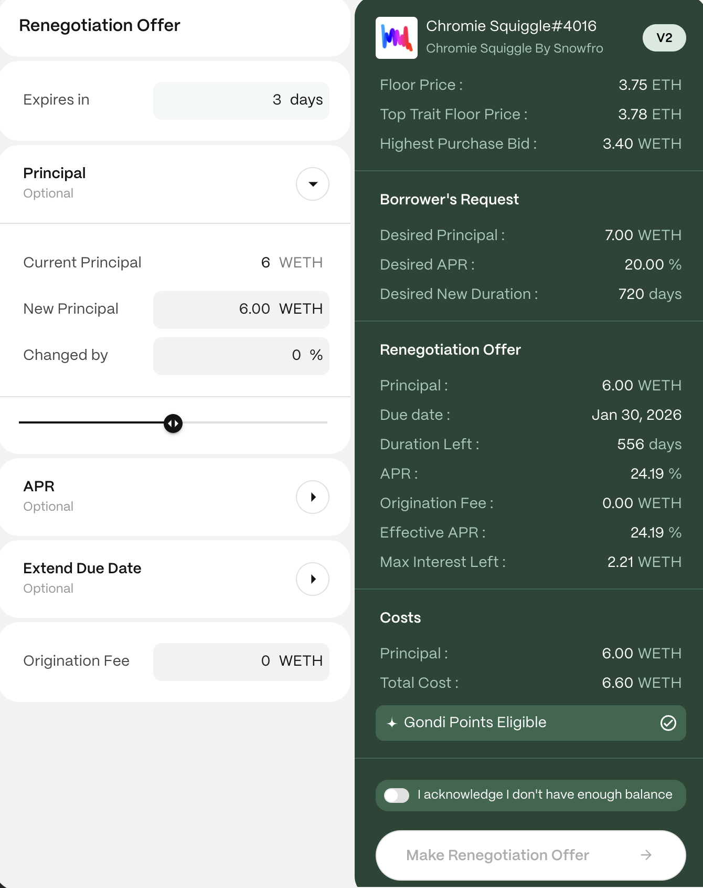

## Renegotiation vs. Refinancing

Renegotiation allows lenders to propose changes to the terms of outstanding loans, such as extending the due date, changing the interest rate, or offering more principal. This is not to be confused with refinancing, which allows lenders to instantly take over outstanding loans by lowering the APR.

For more details on loan renegotiation, check out [Renegotiations](/gondi-v3/renegotiations/).

## Step 1: Access the Renegotiation Flow

* Navigate to the [Make Offers](https://www.gondi.xyz/make-offers#renegotiations) page from the main menu.
* Select the 'Renegotiations' tab to find a list of outstanding offers open for renegotiations.

## Step 2: Choose a Loan and Initiate the Offer

* From the list, select the loan you'd like to renegotiate.
* Click on the "Make Renegotiation Offer" button.

:::note
For more details on a loan, click the white arrow to open its profile page. Here, you'll find past activity and other information, and you can also start the renegotiation process.
:::

## Step 3: Connect Your Wallet

* Ensure your wallet is connected to GONDI. You'll be prompted to connect it at this step if it isn't.
* For extra peace of mind, double-check you’re on GONDI’s official site <https://gondi.xyz>.

## Step 4: Define Your Renegotiation Proposal

* **Expiration Date:** Set a timeframe for your offer's validity. Consider at least three days to give the borrower enough time.
* **Principal (optional):** Enter the new loan amount you'd like to lend.
* **New APR (optional):** Adjust the proposed interest rate using the APR bar.
* **New Due Date (optional):** Set a new repayment deadline, with a minimum adjustment of five days from the current due date.
* **Origination Fee (optional):** You can optionally include an origination fee you'll receive when the borrower accepts the offer. The fee is deducted from the loan principal and must be less than 10% of the principal.

## Step 5: Review the Terms of the Offer

Before submitting your proposal, carefully review all the details.

### Key Terms of the Offer

* **Principal:** The total loan amount being offered (WETH or USDC).
* **Due Date:** The final repayment date for the loan.
* **Duration Left:** The remaining days until the new due date of the proposal.
* **APR:** The annual percentage rate on the loan.
* **Origination Fee (optional):** The upfront fee the borrower pays if they accept the renegotiation offer.
* **Effective APR:** The actual interest rate the borrower will pay when including the origination fee.
* **Max Interest Left:** The total interest the borrower would pay if they continued with the original terms.

## Step 6: Confirm the Offer

* After reviewing, click the “Make Renegotiation Offer” button to submit it.
* GONDI V3 streamlined renegotiations by allowing lenders to pay only the difference, not the full balance. This reduces upfront capital needs.

:::note
You can make renegotiation offers without having enough balance in your wallet, but the offer will only become visible to the borrower once your wallet has sufficient funds.
:::

## Step 7: Wait for Borrower

Loan terms in a renegotiation might not always be strictly better for the borrower, so the final decision rests with the borrower to accept or reject the offer. Be prepared to adjust your terms to reach an agreement.

Once you initiate a renegotiation request, the borrower should review your offer and respond within the specified timeframe. If you submit it in your GONDI profile, you’ll be notified of their decision by email or through the GONDI dApp.

***

These steps should help you effectively negotiate loans. If you need further clarification or assistance, feel free to ask in [GONDI’s Discord](http://discord.gg/gondi).
